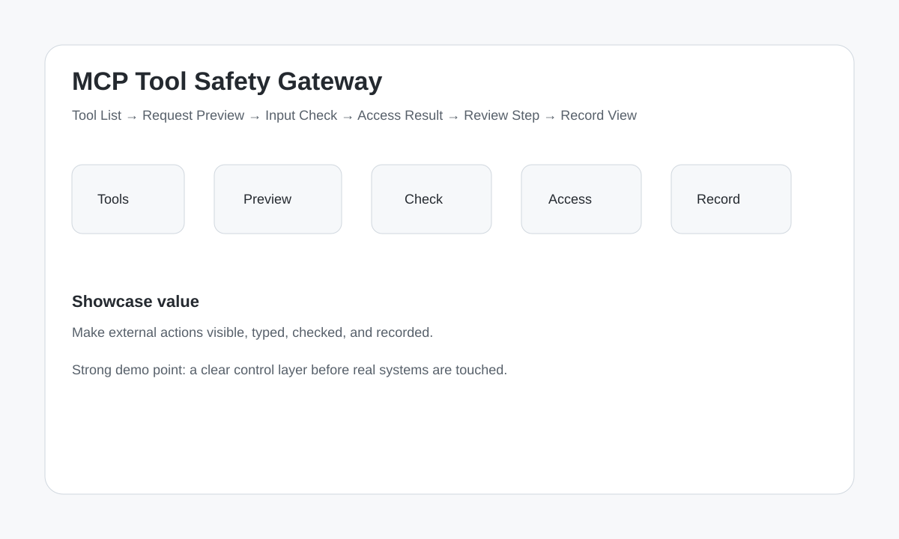

# Design Gallery

## Overview

## Demo intent

Use this visual as the first layout direction for the MVP demo.

The product should make tool use visible through:

- tool list
- request preview
- input check
- access result
- review step
- record view
